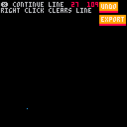
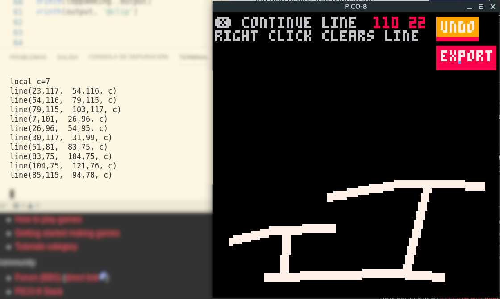

# Map Designer

  

A simple tool that allows you to draw lines on the screen using the mouse.

__EXPORT__ button prints _Pico 8_ code for generating those lines. Uses stdout and also copies that code to the clipboard.

For seeing stdout you must run Pico 8 from a terminal,  otherwise use the clipboard.

  

