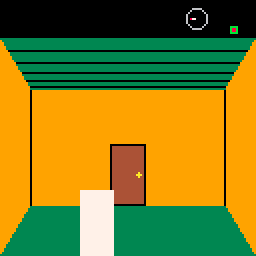
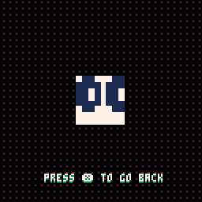
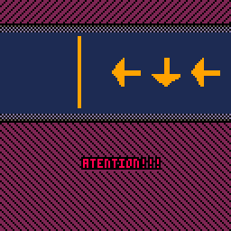

# Mechanic States

Different game states for use with the _Super Fast Framework_.

## Cabin state

A pseudo 3D view of the insides of a cabin. Inspired by the cabins in _Friday the 13th_ NES game.  
Includes a map of the different rooms inside the cabin and a compass for easier navigation.

For more details of it's implementation read the comments on the code.

  

## Vertigo state

A simple visual effect of grabbing a given sprite and rendering it centered on the screen while zooming in and out.

  

## Rhythm state

A simplified "guitar hero" like mechanic. First made for my Ludum Dare 41 Compo entry: "Platform Hero".  

This state takes 2 arguments. The first one being an object containing a table with "notes" and a speed.  
The speed argument controls the speed of the notes moving through the screen, and the notes argument contains a table with N numbers. This numbers can be 0, 1, 2 or 3, meaning _left_, _right_, _up_ and _down_ respectively.

  

